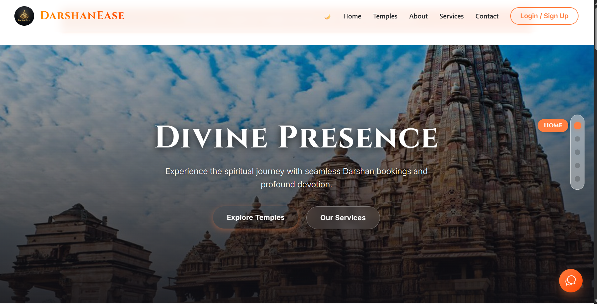
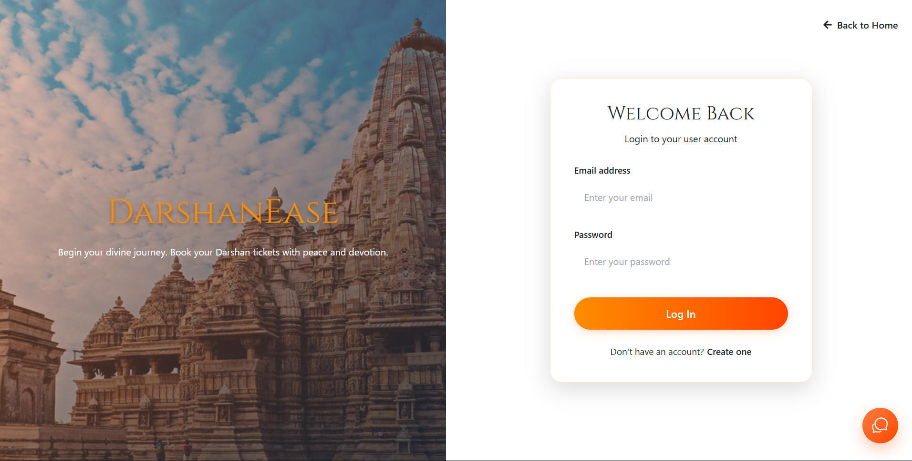
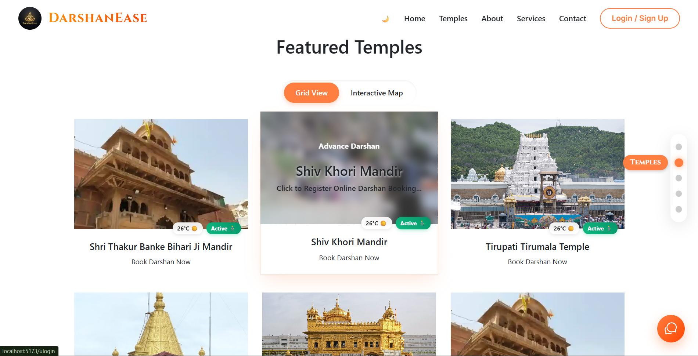
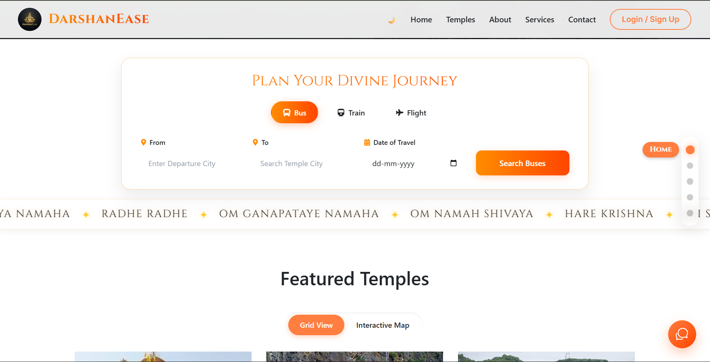

<a id="readme-top"></a>

<br />
<div align="center">
  <h1 align="center">🛕 DarshanEase</h1>

  <p align="center">
    <strong>A Smart Spiritual Travel Platform for Seamless Pilgrimage Experiences</strong>
    <br />
    <br />
    <a href="#-getting-started"><strong>Explore the docs »</strong></a>
    <br />
    <br />
    <a href="#-project-preview">View Demo</a>
    ·
    <a href="https://github.com/Deo-Mohan/DarshanEase/issues">Report Bug</a>
    ·
    <a href="https://github.com/Deo-Mohan/DarshanEase/issues">Request Feature</a>
  </p>
</div>

<div align="center">
  
  
  
  
  
</div>

---

<details>
  <summary><h2>📑 Table of Contents</h2></summary>
  <ol>
    <li><a href="#-about-the-project">About The Project</a></li>
    <li><a href="#-project-preview">Project Preview</a></li>
    <li><a href="#-key-features">Key Features</a></li>
    <li><a href="#-system-architecture">System Architecture</a></li>
    <li><a href="#%EF%B8%8F-technology-stack">Technology Stack</a></li>
    <li><a href="#-getting-started">Getting Started</a>
      <ul>
        <li><a href="#prerequisites">Prerequisites</a></li>
        <li><a href="#installation">Installation</a></li>
        <li><a href="#environment-variables">Environment Variables</a></li>
      </ul>
    </li>
    <li><a href="#-api-reference">API Reference</a></li>
    <li><a href="#-roadmap">Roadmap</a></li>
    <li><a href="#-contributing">Contributing</a></li>
    <li><a href="#-license">License</a></li>
    <li><a href="#-author">Author</a></li>
  </ol>
</details>

---

## 🌟 About The Project

**DarshanEase** is a modern spiritual travel platform engineered to simplify pilgrimage journeys across India. 

Traditionally, devotees have to juggle multiple applications for travel planning, temple slot bookings, and spiritual guidance. DarshanEase solves this by providing **a unified, immersive ecosystem where devotees can manage their entire pilgrimage experience from a single dashboard.**

The core philosophy of this project is to seamlessly merge **technology with spirituality**, creating a peaceful, efficient, and deeply engaging pilgrimage planning experience.

<p align="right">(<a href="#readme-top">back to top</a>)</p>

---

## 🖼️ Project Preview

<table align="center">
  <tr>
    <td align="center"><strong>🏠 Homepage</strong></td>
    <td align="center"><strong>🔐 Login Page</strong></td>
  </tr>
  <tr>
    <td></td>
    <td></td>
  </tr>
  <tr>
    <td align="center"><strong>🛕 Temple Booking</strong></td>
    <td align="center"><strong>🚠 Journey Planner</strong></td>
  </tr>
  <tr>
    <td></td>
    <td></td>
  </tr>
</table>

<p align="right">(<a href="#readme-top">back to top</a>)</p>

---

## ✨ Key Features

* **🚠 Smart Journey Planner:** Book Buses, Trains, and Flights alongside Darshan slots, viewing everything in a single, integrated itinerary dashboard.
* **🤖 AI Spiritual Assistant:** An intelligent chatbot designed to answer spiritual queries, provide temple history, and assist with platform navigation.
* **🗺️ Interactive Temple Maps:** Powered by Leaflet.js, allowing users to discover temple locations, explore nearby services, and navigate optimal routes.
* **🎨 Immersive UI/UX:** A visually peaceful experience utilizing 3D graphics (Three.js), smooth animations (Framer Motion), and a dynamic **Spiritual Mantra Scroll** (chanting Om Namah Shivaya, Hare Krishna, Om Ganapataye Namaha, etc.).
* **📱 Multi-Role Dashboard:** * *User Dashboard:* Book Darshan slots, track travel, manage itineraries, and get notifications.
    * *Organizer Dashboard:* Manage temple schedules and Darshan slot capacities.
    * *Admin Dashboard:* Oversee platform analytics, user management, temples, and services.

<p align="right">(<a href="#readme-top">back to top</a>)</p>

---

## 🏗️ System Architecture

```text
User / Client Browser
      │ (REST API Calls)
      ▼
React + Vite Frontend
      │ (Axios Requests)
      ▼
Node.js + Express Backend
      ├──> MongoDB Database (Mongoose ODM)
      ├──> AI Chatbot Service
      ├──> Map Services
      └──> Multer File Uploads
```

<p align="right">(<a href="#readme-top">back to top</a>)</p>

---

## 🛠️ Technology Stack

### **Frontend**
* **Core:** React.js, Vite
* **Styling:** TailwindCSS, Bootstrap, Vanilla CSS
* **3D & Animations:** Three.js, @react-three/fiber, @react-three/drei, Framer Motion, React Spring
* **Utilities:** Leaflet, React Leaflet (Maps), Recharts (Data Viz), React Router DOM, Context API

### **Backend**
* **Core:** Node.js, Express.js
* **Database:** MongoDB, Mongoose ODM
* **Middleware:** Multer (File Handling), CORS
* **Communication:** Axios

<p align="right">(<a href="#readme-top">back to top</a>)</p>

---

## 🚀 Getting Started

Follow these steps to set up the project locally on your machine.

### Prerequisites

* Node.js (v16.0.0 or higher)
* MongoDB (Local instance or MongoDB Atlas URI)
* Git

### Installation

**1. Clone the repository**
```bash
git clone [https://github.com/Deo-Mohan/DarshanEase.git](https://github.com/Deo-Mohan/DarshanEase.git)
cd DarshanEase
```

**2. Setup and Start the Frontend**
```bash
cd Frontend
npm install
npm run dev
```
*Frontend runs at: `http://localhost:5173`*

**3. Setup and Start the Backend**
```bash
cd backend
npm install
npm start
```
*Backend runs at: `http://localhost:7000`*

### Environment Variables

Create a `.env` file in the root of your `/backend` directory and add the following:

```env
PORT=7000
MONGO_URI=your_mongodb_connection_string
JWT_SECRET=your_super_secret_jwt_key
```

<p align="right">(<a href="#readme-top">back to top</a>)</p>

---

## 📡 API Reference

Here are some of the core REST endpoints available in the backend:

| Method | Endpoint | Description | Auth Required |
|---|---|---|---|
| `POST` | `/api/auth/register` | Register a new user account | ❌ No |
| `POST` | `/api/auth/login` | Authenticate user & get token | ❌ No |
| `GET` | `/api/temples` | Fetch all available temples | ❌ No |
| `GET` | `/api/temples/:id` | Get specific temple details | ❌ No |
| `POST` | `/api/bookings` | Create a new Darshan/Travel booking | 🔒 Yes |
| `GET` | `/api/bookings/user` | Get all bookings for logged-in user | 🔒 Yes |

<p align="right">(<a href="#readme-top">back to top</a>)</p>

---

## 🛣️ Roadmap

- [x] Basic user authentication and authorization
- [x] Temple listing and dynamic routing
- [x] Interactive maps integration
- [ ] AI-based crowd prediction algorithm
- [ ] Smart Darshan slot recommendation engine
- [ ] Voice-based spiritual assistant
- [ ] Mobile application
- [ ] Temple donation payment gateway integration
- [ ] Multi-language support
- [ ] AR temple exploration mode

<p align="right">(<a href="#readme-top">back to top</a>)</p>

---

## 🤝 Contributing

Contributions are what make the open-source community such an amazing place to learn, inspire, and create. Any contributions you make are **greatly appreciated**.

1. Fork the Project
2. Create your Feature Branch (`git checkout -b feature/AmazingFeature`)
3. Commit your Changes (`git commit -m 'Add some AmazingFeature'`)
4. Push to the Branch (`git push origin feature/AmazingFeature`)
5. Open a Pull Request

<p align="right">(<a href="#readme-top">back to top</a>)</p>

---

## 📜 License

Distributed under the **ISC License**. See `LICENSE.txt` for more information.

<p align="right">(<a href="#readme-top">back to top</a>)</p>

---

## 👨‍💻 Author

**Krishna Mohan Kumar** *B.Tech Computer Science Student at Valency College, Bhopal* *Full Stack Developer | Tech Enthusiast*

Passionate about building **technology solutions that merge spirituality and innovation.**

* **GitHub:** [@Deo-Mohan](https://github.com/Deo-Mohan)
* **LinkedIn:** [Krishna Mohan Kumar](https://linkedin.com/in/krishna-mohan-kumar)

<p align="center">
  <br/>
  ⭐ <i>If you like this project, please consider starring the repository!</i> ⭐
</p>
